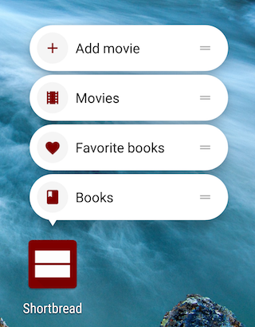

Shortbread
==========

Android library that generates [app shortcuts][1] for activities and methods annotated with `@Shortcut`.
No need to touch the manifest, create XML files or use the shortcut manager. Just annotate the code that
you want the shortcut to call.



The four shortcuts above are produced by the following code:

```kotlin
@Shortcut(id = "movies", icon = R.drawable.ic_shortcut_movies, shortLabel = "Movies")
class MoviesActivity : Activity() {

    // ...

    @Shortcut(id = "add_movie", icon = R.drawable.ic_shortcut_add, shortLabel = "Add movie")
    fun addMovie() {
        // could show an AddMovieDialogFragment for example
    }
}
```

```kotlin
@Shortcut(id = "books", icon = R.drawable.ic_shortcut_books, shortLabel = "Books")
class BooksActivity : Activity() {

    // ...

    @Shortcut(id = "favorite_books", icon = R.drawable.ic_shortcut_favorite, shortLabel = "Favorite books")
    fun showFavoriteBooks() {
        // could show a FavoriteBooksFragment for example
    }
}
```

Shortcuts can be customized with attributes, just like using the framework API.

<details open>
<summary>Kotlin</summary>

```kotlin
@Shortcut(
    id = "books",
    icon = R.drawable.ic_shortcut_books,
    shortLabel = "Books",
    shortLabelRes = R.string.shortcut_books_short_label,
    longLabel = "List of books",
    longLabelRes = R.string.shortcut_books_long_label,
    rank = 2, // order in list, relative to other shortcuts
    disabledMessage = "No books are available",
    disabledMessageRes = R.string.shortcut_books_disabled_message,
    enabled = true, // default
    backStack = [MainActivity::class, MainActivity::class],
    activity = MainActivity::class, // the launcher activity to which the shortcut should be attached
    action = "shortcut_books" // intent action to identify the shortcut from the launched activity
)
```
</details>
<details>
<summary>Java</summary>

```java
@Shortcut(
    id = "books",
    icon = R.drawable.ic_shortcut_books,
    shortLabel = "Books",
    shortLabelRes = R.string.shortcut_books_short_label,
    longLabel = "List of books",
    longLabelRes = R.string.shortcut_books_long_label,
    rank = 2, // order in list, relative to other shortcuts
    disabledMessage = "No books are available",
    disabledMessageRes = R.string.shortcut_books_disabled_message,
    enabled = true, // default
    backStack = {MainActivity.class, LibraryActivity.class},
    activity = MainActivity.class, // the launcher activity to which the shortcut should be attached
    action = "shortcut_books" // intent action to identify the shortcut from the launched activity
)
```
</details>

Download
--------

Shortbread is available on `mavenCentral()`.

<details open>
<summary>Kotlin</summary>

```groovy
apply plugin: 'kotlin-kapt'

dependencies {
    implementation 'com.github.matthiasrobbers:shortbread:1.4.0'
    kapt 'com.github.matthiasrobbers:shortbread-compiler:1.4.0'
}
```
</details>
<details>
<summary>Java</summary>

```groovy
dependencies {
    implementation 'com.github.matthiasrobbers:shortbread:1.4.0'
    annotationProcessor 'com.github.matthiasrobbers:shortbread-compiler:1.4.0'
}
```
</details>

Non-final resource IDs
----------------------
If you are using resource IDs in `@Shortcut` attributes auch as `shortLabelRes`, which is recommended, you may see this
warning in Android Studio:
> Resource IDs will be non-final in Android Gradle Plugin version 5.0, avoid using them as annotation attributes.

If the annotation is located inside a library, the project won't even compile. To overcome this, add the Shortbread
Gradle plugin and apply it to your modules:

```groovy
buildscript {
    repositories {
        mavenCentral()
    }
    dependencies {
        classpath 'com.github.matthiasrobbers:shortbread-gradle-plugin:1.4.0'
    }
}
```

```groovy
apply plugin: 'com.github.matthiasrobbers.shortbread'
```

Now make sure you use `R2` instead of `R` inside all `@Shortcut` annotations. If you are using `mipmap` as shortcut icon
resource type, switch to `drawable` by simply moving the resources from the `mipmap-` folders to the corresponding
`drawable-` folders.

```kotlin
@Shortcut(icon = R2.drawable.ic_shortcut_movies, shortLabelRes = R2.string.label_movies)
```

The plugin uses the [Butter Knife][2] Gradle plugin to generate the `R2` class with final values. Referencing them does
not make the warning disappear (you can suppress it with `@SuppressLint("NonConstantResourceId")`), but most likely will
be the only way to use resource IDs in annotations in the future.
<details>
<summary>Alternative to Gradle plugin</summary>

If for you can't (or don't want to) use the plugin, you can use the additional deprecated string attributes like
`iconResName`, `shortLabelResName` and so on.

```kotlin
@Shortcut(iconResName = "ic_shortcut_movies", shortLabelResName = "label_movies")
```
</details>

License
-------

    Copyright 2017 Matthias Robbers

    Licensed under the Apache License, Version 2.0 (the "License");
    you may not use this file except in compliance with the License.
    You may obtain a copy of the License at

       http://www.apache.org/licenses/LICENSE-2.0

    Unless required by applicable law or agreed to in writing, software
    distributed under the License is distributed on an "AS IS" BASIS,
    WITHOUT WARRANTIES OR CONDITIONS OF ANY KIND, either express or implied.
    See the License for the specific language governing permissions and
    limitations under the License.


 [1]: https://developer.android.com/guide/topics/ui/shortcuts.html
 [2]: https://github.com/JakeWharton/butterknife
